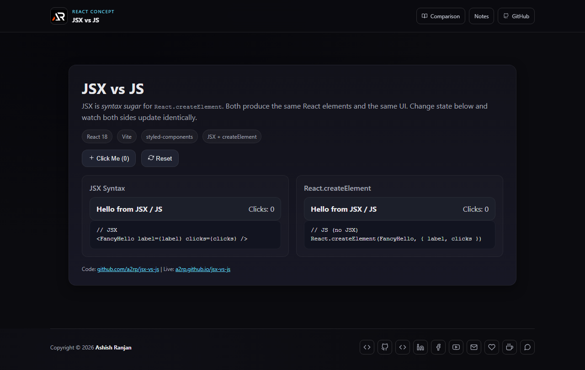

# JSX vs JS

An interactive React micro-app that renders the same UI with JSX and `React.createElement`. Change the shared counter to see both approaches stay in sync.

## Features

- Side-by-side JSX and `React.createElement` examples
- Shared state with increment and reset controls
- Responsive comparison layout with accessible labels
- Fixed branded header, icon-only footer links, and go-to-top button

## Tech stack

React, Vite, styled-components, and react-icons.

## Run locally

```bash
npm install
npm run dev
```

Build and deploy:

```bash
npm run lint
npm run build
npm run deploy
```

## Screenshot



## Links

- Live: [https://a2rp.github.io/jsx-vs-js/](https://a2rp.github.io/jsx-vs-js/)
- Repository: [https://github.com/a2rp/jsx-vs-js](https://github.com/a2rp/jsx-vs-js)
- Portfolio: [https://www.ashishranjan.net/](https://www.ashishranjan.net/)
- GitHub: [https://github.com/a2rp](https://github.com/a2rp)
- CodePen: [https://codepen.io/ash1198](https://codepen.io/ash1198)
- LinkedIn: [https://www.linkedin.com/in/aashishranjan](https://www.linkedin.com/in/aashishranjan)
- Facebook: [https://www.facebook.com/theash.ashish/](https://www.facebook.com/theash.ashish/)
- YouTube: [https://www.youtube.com/@ashishranjan-ashz?sub_confirmation=1](https://www.youtube.com/@ashishranjan-ashz?sub_confirmation=1)
- Email: [ash.ranjan09@gmail.com](mailto:ash.ranjan09@gmail.com)

## Support

- Support: [https://a2rp-donation-page.netlify.app/](https://a2rp-donation-page.netlify.app/)
- Buy Me a Coffee: [https://buymeacoffee.com/a2rp](https://buymeacoffee.com/a2rp)
- Patreon: [https://www.patreon.com/a2rp](https://www.patreon.com/a2rp)
